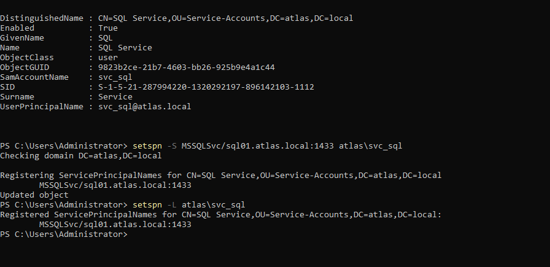

# AC-001 — Compromised Domain User & Kerberoasting

## Scenario

This attack chain simulates the compromise of a standard AtlasTech domain user followed by Active Directory reconnaissance and suspicious Kerberos service ticket activity.

The objective is not only to reproduce attacker behavior, but to analyze the resulting telemetry from a SOC perspective using Windows auditing, Sysmon, and Splunk.

## Attack Path

```text
Compromised Domain User
        ↓
Active Directory Enumeration
        ↓
Service Account Discovery
        ↓
Kerberos Service Ticket Request
        ↓
SOC Detection
        ↓
Incident Investigation
```

## Lab Accounts

| Account | Role |
|---|---|
| `yassine.foundou` | Standard domain user |
| `svc_sql` | Kerberos service account |
| `badr.admin` | Domain administrator |

## Preparation — Kerberos Service Account

The existing `svc_sql` account was configured with the following Service Principal Name (SPN):

```text
MSSQLSvc/sql01.atlas.local:1433
```

The SPN was registered using:

```powershell
setspn -S MSSQLSvc/sql01.atlas.local:1433 atlas\svc_sql
```

The configuration was validated using:

```powershell
setspn -L atlas\svc_sql
```

This creates a controlled Kerberos-enabled service account that can be used to generate realistic service-ticket telemetry during the scenario.

> No production infrastructure or external systems are involved. All activity is restricted to the isolated `atlas.local` lab environment.

### Evidence


