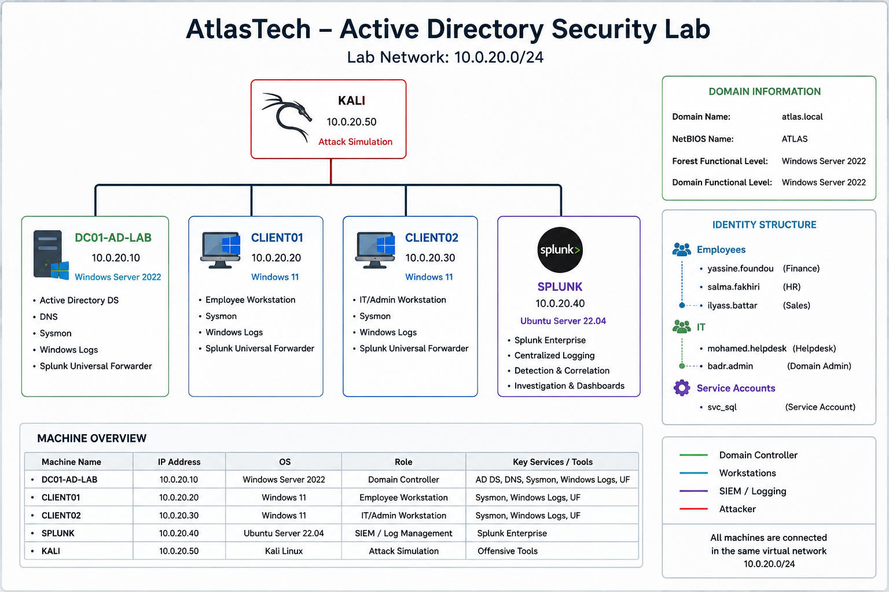

# ENV-001 — Active Directory Lab Design

## Objective

Design a small enterprise-style Active Directory environment for simulating, detecting, and investigating realistic identity-based attacks.

The lab is designed from both attacker and SOC analyst perspectives, with centralized security telemetry collected in Splunk.

---

## Environment Overview

The fictional organization used in this lab is **AtlasTech**.

- **Active Directory Domain:** `atlas.local`
- **Network:** `10.0.20.0/24`
- **Environment Type:** Isolated virtual lab
- **Primary Focus:** Active Directory Security, Attack Detection, and Incident Investigation

## Architecture

---

## Machines

| Hostname | IP Address | Operating System | Role |
|---|---|---|---|
| DC01-AD-LAB | 10.0.20.10 | Windows Server 2022 | Domain Controller / DNS |
| CLIENT01 | 10.0.20.20 | Windows 11 | Employee Workstation |
| CLIENT02 | 10.0.20.30 | Windows 11 | IT/Admin Workstation |
| SPLUNK | 10.0.20.40 | Ubuntu Server | SIEM / Centralized Logging |
| KALI | 10.0.20.50 | Kali Linux | Controlled Attack Simulation |

---

## Active Directory Identity Structure

### Employees

| Account | Department | Role |
|---|---|---|
| `yassine.foundou` | Finance | Standard Domain User |
| `salma.fakhiri` | Human Resources | Standard Domain User |
| `ilyass.battar` | Sales | Standard Domain User |

### IT Accounts

| Account | Role | Privilege Level |
|---|---|---|
| `mohamed.helpdesk` | Helpdesk | Delegated IT Permissions |
| `badr.admin` | Domain Administrator | Privileged |

### Service Accounts

| Account | Purpose |
|---|---|
| `svc_sql` | Service account used for Kerberos/SPN security testing |

---

## Security Monitoring

Security telemetry will be collected from the Domain Controller and Windows workstations and forwarded to Splunk.

The monitoring environment will include:

- Windows Security Event Logs
- Active Directory authentication events
- Kerberos events
- Account and group management events
- Directory Service auditing
- Sysmon endpoint telemetry
- Relevant process and network activity

Splunk will be used for centralized detection, correlation, and SOC investigation.

---

## Planned Attack Paths

The environment will support realistic Active Directory attack chains involving:

- Compromised domain accounts
- Active Directory reconnaissance
- Password and authentication attacks
- Kerberos abuse
- Privilege escalation
- Lateral authentication
- Privileged group modifications
- Persistence
- Optional domain-level compromise

---

## Result

The lab architecture and identity structure were defined before deployment to ensure that future attack scenarios represent realistic enterprise behavior and generate useful security telemetry for SOC investigation.
