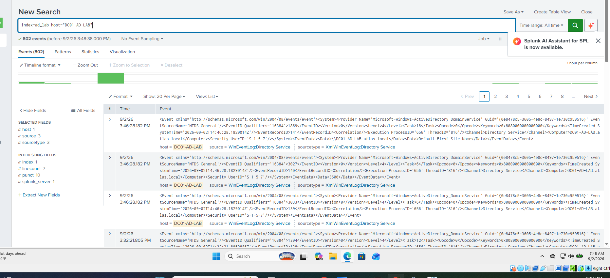
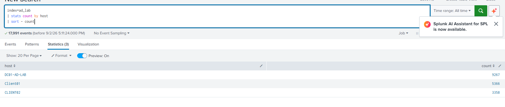
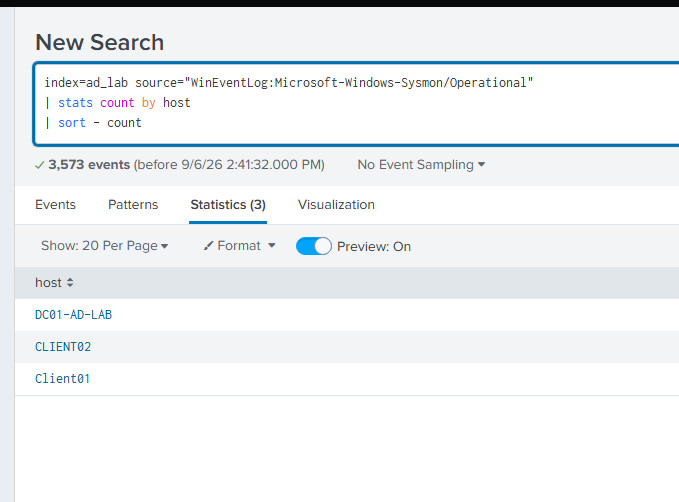

## Telemetry Validation

### Domain Controller Telemetry

Windows Event Logs from the Domain Controller were successfully forwarded to the dedicated Splunk `ad_lab` index.



---

### Centralized Windows Telemetry

The following Splunk search was used to verify event collection across the monitored Windows systems:

```spl
index=ad_lab
| stats count by host
| sort - count
```

Telemetry was successfully received from the Domain Controller and both Windows workstations.



---

### DC01 Sysmon Telemetry

After deploying Sysmon and configuring the Splunk Universal Forwarder, Sysmon Operational events were successfully ingested from the Domain Controller.


---

### Sysmon Telemetry Across All Hosts

The following search was used to validate centralized Sysmon telemetry:

```spl
index=ad_lab source="WinEventLog:Microsoft-Windows-Sysmon/Operational"
| stats count by host
| sort - count
```

Sysmon telemetry was successfully observed from:

- DC01-AD-LAB
- CLIENT01
- CLIENT02



This confirms that the endpoint telemetry pipeline is operational across all monitored Windows systems.
